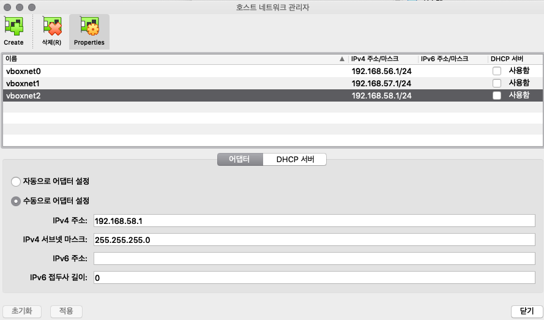
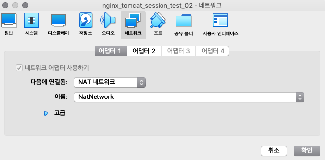
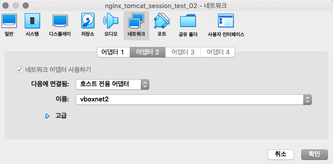
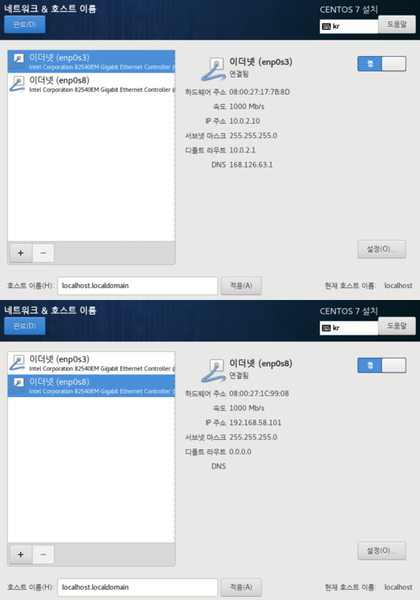
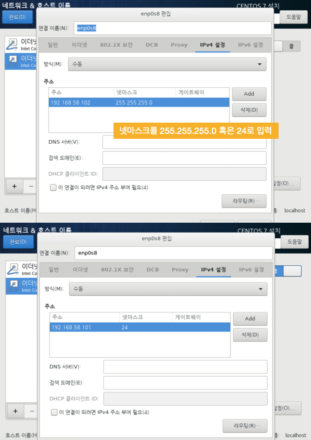
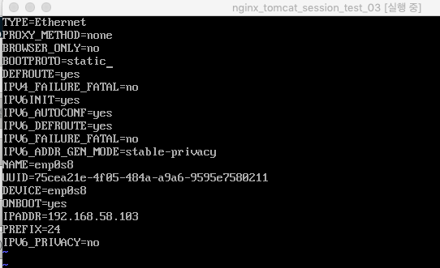
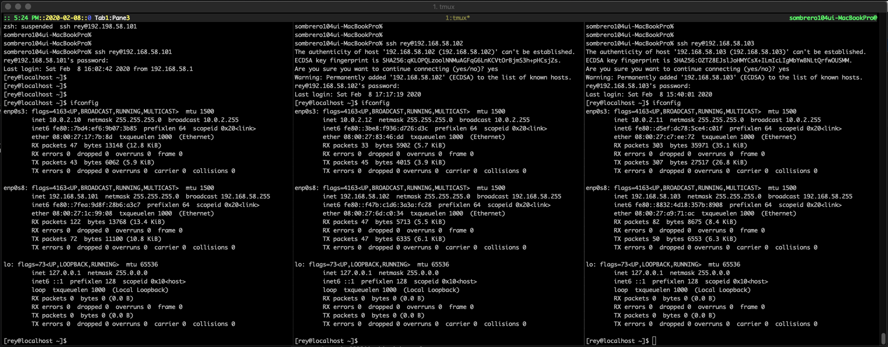

# Virtualbox
 

### 1. 호스트 네트워크 관리자를 설정한다.
 
 

### 2. 각 가상머신마다 네트워크를 설정한다.
### * 어댑터 설정 추가 
#### (1) 어댑터 1: NAT NETWORK 추가 (enp0s3 -> 10.0.2.12) 
	=> 외부 네트워크 연결 + 공유기 역할
		(NAT NETWORK가 아닌 NAT는 외부 네트워크 연결만 함)
#### (2) 어댑터 2: 호스트 전용 어댑터 추가 (enp0s8 -> 192.168.58.102) 
	=> vm이 설치된 호스트와의 연결

 
 
 

### 3. CentOs 설치 시 네트워크를 설정해준다.
 
 

### 4. 호스트 네트워크는 수동으로 설정해준다.
(호스트 네트워크 관리자에서 설정한 IPv4 주소 대역으로 IP를 만든다.)
 
 

### 5. 이더넷카드 설정
호스트 네트워크인 /etc/sysconfig/network-scripts/ifcfg-enp0s8 파일을 편집한다.
<pre>
* 시스템 시작시 자동으로 활성화
ONBOOT=yes

* 장치명, 첫번째 이더넷 카드
DEVICE=enp0s8

* IP 주소 지정
IPADDR=192.168.58.102

* IP 부여 방식 결정, static은 고정IP
BOOTPROTO=static
</pre>
편집 완료 후 네트워크를 재시작하면 적용 완료.  
('service network restart' 혹은 '/etc/rc.d/init.d/network restart')  

 

### 6. iTerm에서 접속
ssh rey@192.168.58.102 

 

    

# Tmux
 

## Tmux 실행
tmux 입력해서 실행. 
prefix 키를 누른 다음 키보드에서 손을 떼고, 그 다음에 bind 키를 누른다. 
예를 들어 prefix 키가 Ctrl + b이고(디폴트가 Ctrl + b 이다.) bind 키가 p인 경우, 
Ctrl + b를 눌렀다가 키보드에서 손을 떼고, 그 다음에 p를 누른다. 
  

## Tmux 세팅
### Tmux 설정 변경 (.tmux.conf 파일 변경 후 적용.)
=> git의 /sample/.tmux.conf 파일 참조. (파일 그대로 세팅해도 됨. 현재 tmux2.8 버전에서 설정해서 사용 중..)  

#### * prefix 키를 Ctrl + b에서 Ctrl + c로 변경
원래는 prefix 키가 Ctrl + b인데 Ctrl + c로 바꿔줌. (키보드 위치가 넘 멀어서..) 
<pre>
set -g prefix C-c
unbind C-b
unbind C-a
</pre>

#### * 분할창 동시 입력
Ctrl + c, p 입력하면 분할된 창 모두 동시 키보드 입력되도록 설정.
<pre>
bind-key p set-window-option synchronize-panes
</pre> 

## Tmux 명령

#### Ctrl + c, 스페이스
분할된 창(pane)을 동일한 크기로 변경하거나 계속 누르면 다른 창 분할 모드로 바꿔줌.. 

#### Ctrl + c, r
tmux가 실행되고 있을 때, .tmux.conf 파일 수정 후 바로 적용해 줌. 
혹은 'tmux source-file ~/.tmux.current.conf' 입력. 

#### Ctrl + c, ,
창 이름 변경. 

#### Ctrl + c, p
분할된 창 모두 동시에 키보드 입력. 
(.tmux.conf로 설정하지 않은 경우에는 'setw synchronize-panes on' 입력하면 사용할 수 있다.) 

 
